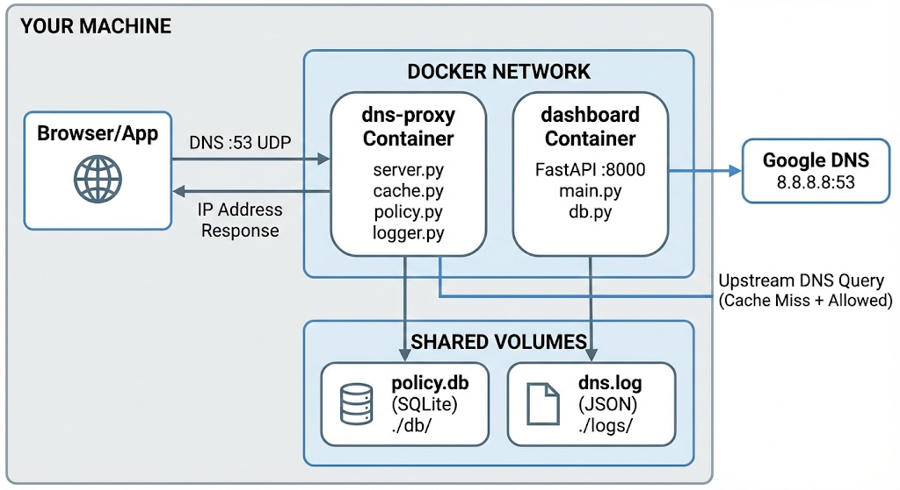

# DNS Filtering Proxy

A Docker-based DNS filtering solution with policy management and real-time dashboard monitoring.

---

## Architecture Diagram




## Table of Contents

- [Architecture Overview](#architecture-overview)
- [Why UDP and Not TCP?](#why-udp-and-not-tcp)
- [Technology Choices](#technology-choices)
- [Setup Guide](#setup-guide)
  - [Prerequisites](#prerequisites)
  - [Step 1: Free Up Port 53](#step-1-free-up-port-53)
  - [Step 2: Build and Run Docker Containers](#step-2-build-and-run-docker-containers)
  - [Step 3: Configure System DNS](#step-3-configure-system-dns)
  - [Step 4: Verification and Testing](#step-4-verification-and-testing)
- [Rollback Instructions](#rollback-instructions)
- [Future Improvements](#future-improvements)

---

## Architecture Overview

The DNS filtering proxy consists of three main components:

1. **DNS Proxy Server** - Intercepts and filters DNS queries on port 53
2. **Policy Engine** - Manages filtering rules and blocklists
3. **Admin Dashboard** - FastAPI-based web interface for monitoring and configuration

All components run in Docker containers with persistent storage for logs and policies.

---

## Why UDP and Not TCP?

DNS primarily uses UDP port 53 because:
- Lower latency for small query/response packets
- Stateless protocol suits UDP's connectionless nature
- Standard DNS queries fit within UDP's 512-byte limit (or 4096 with EDNS)
- TCP is only used for zone transfers or responses exceeding UDP limits

---

## Technology Choices

**Why FastAPI over Flask/Django?**
- Async/await support for concurrent DNS log processing
- Automatic API documentation with OpenAPI/Swagger
- High performance with minimal overhead
- Modern Python type hints and validation with Pydantic

---

## Setup Guide

### Prerequisites

- Docker and Docker Compose installed
- Fedora Linux (or similar systemd-based distribution)
- Root/sudo access for network configuration

---

### Step 1: Free Up Port 53

Port 53 must be available for the DNS proxy. Disable systemd-resolved's DNS stub listener:

**1.1 Create configuration directory**
```bash
sudo mkdir -p /etc/systemd/resolved.conf.d
```

**1.2 Disable DNS stub listener**
```bash
sudo nano /etc/systemd/resolved.conf.d/dnsstub.conf
```

Add the following content:
```ini
[Resolve]
DNSStubListener=no
```

Save and exit (`Ctrl+O`, `Enter`, `Ctrl+X`).

**1.3 Restart systemd-resolved**
```bash
sudo systemctl restart systemd-resolved
```

**1.4 Verify port 53 is free**
```bash
sudo ss -lupn | grep :53
```

**Expected output:** No output (port is free)

---

### Step 2: Build and Run Docker Containers

**2.1 Stop any existing containers**
```bash
docker compose down
```

**2.2 Build container images**
```bash
docker compose build
```

**2.3 Start all services**
```bash
docker compose up
```

**Expected output:**
```
dns_proxy      | [+] DNS Proxy listening on 0.0.0.0:53
dns_dashboard  | Uvicorn running on http://0.0.0.0:8000
```

> **Note:** Keep this terminal running. Open a new terminal for subsequent steps.

---

### Step 3: Configure System DNS

Configure NetworkManager to use the local DNS proxy for both IPv4 and IPv6.

**3.1 Identify your active network connection**

Find your connection name:
```bash
nmcli connection show --active
```

Example connection name: `OPPO Reno10 5G`

**3.2 Configure IPv4 DNS**
```bash
sudo nmcli connection modify "OPPO Reno10 5G" ipv4.ignore-auto-dns yes
sudo nmcli connection modify "OPPO Reno10 5G" ipv4.dns "127.0.0.1"
```

**3.3 Disable IPv6 DNS bypass**
```bash
sudo nmcli connection modify "OPPO Reno10 5G" ipv6.ignore-auto-dns yes
sudo nmcli connection modify "OPPO Reno10 5G" ipv6.dns ""
```

**3.4 Restart network connection**
```bash
sudo nmcli connection down "OPPO Reno10 5G"
sudo nmcli connection up "OPPO Reno10 5G"
```

**3.5 Verify DNS configuration**
```bash
resolvectl status
```

**Expected output:**
```
DNS Servers: 127.0.0.1
```

> **Important:** Ensure no other DNS servers (especially IPv6) are listed.

---

### Step 4: Verification and Testing

**4.1 Test allowed domain**
```bash
ping google.com
```
**Expected:** Successful ping response

**4.2 Test blocked domain**
```bash
ping facebook.com
```
**Expected:** `Name or service not known` error

**4.3 Browser testing**

- Navigate to `https://google.com` → Should work
- Navigate to `https://facebook.com` → Should be blocked

**4.4 Monitor real-time logs**
```bash
tail -f logs/dns.log
```

**Expected log entries:**
```json
{"qtype": "A", "domain": "google.com", "decision": "ALLOW"}
{"qtype": "AAAA", "domain": "facebook.com", "decision": "BLOCK"}
```

**4.5 Access admin dashboard**

Open browser: `http://localhost:8000`

---

## Rollback Instructions

To restore your system to its original DNS configuration:

**Step 1: Restore systemd-resolved**
```bash
sudo rm /etc/systemd/resolved.conf.d/dnsstub.conf
sudo systemctl restart systemd-resolved
```

**Step 2: Restore NetworkManager DNS settings**
```bash
sudo nmcli connection modify "OPPO Reno10 5G" ipv4.ignore-auto-dns no
sudo nmcli connection modify "OPPO Reno10 5G" ipv4.dns ""
sudo nmcli connection modify "OPPO Reno10 5G" ipv6.ignore-auto-dns no
sudo nmcli connection modify "OPPO Reno10 5G" ipv6.dns ""
```

**Step 3: Restart network connection**
```bash
sudo nmcli connection down "OPPO Reno10 5G"
sudo nmcli connection up "OPPO Reno10 5G"
```

**Step 4: Stop Docker containers**
```bash
docker compose down
```

**Step 5: Verify restoration**
```bash
resolvectl status
ping google.com
```

---

## Future Improvements

1. **Port Forwarding** - Implement remote DNS filtering capability
2. **Enhanced Admin Panel** - Add statistics, graphs, and policy management UI
3. **Architecture Documentation** - Detailed component interaction diagrams
4. **Performance Optimization** - Cache tuning and query optimization
5. **Security Hardening** - DNSSEC validation and encrypted upstream queries

---

